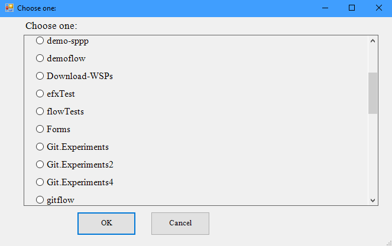
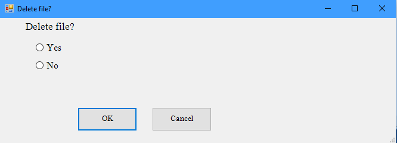
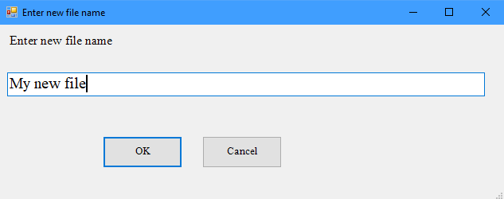
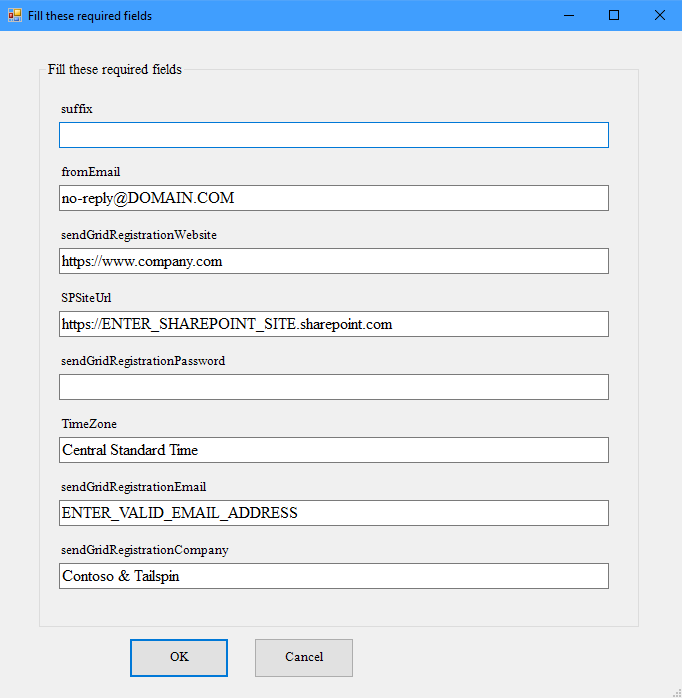
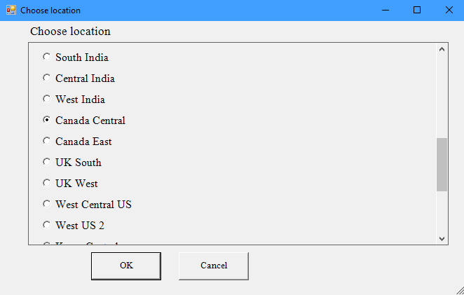
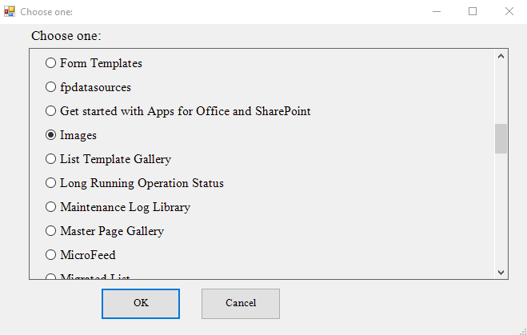

# powershell-forms
Collect user inputs using modal pop-up forms. 
The forms are generated dynamically using a single line of code. Excellent option if you want to make your PowerShell script more user-friendly.

You can use powershell-forms with any sorts of arrays or objects. You can ask a user to select a file from an array of files or maybe a SharePoint List item from an array of items. 

## Getting started

- Download `PS-Forms.ps1` file
- Load the powershell-forms functions by running `. .\PS-Forms.ps1`
- Try out your first dialog by running `Get-FormStringInput "Enter new file name"`


## List of all functions

| Function | Description |
| ------ | ------ |
| Get-FormArrayItem | Select one item from an array of items |
| Get-FormBinaryAnswer | Ask a Yes/No question and get value as a $true or $false |
| Get-FormStringInput | Ask user to enter a string |
| Get-FormItemProperties | Ask a user to fill out all properties of an object |


### Get-FormArrayItem
Select one item from an array of items:
```
$selectedItem = Get-FormArrayItem (Get-ChildItem)
```



### Get-FormBinaryAnswer
Ask a Yes/No question and get value as a $true or $false:

```
$Delete = Get-FormBinaryAnswer "Delete file?"
```




### Get-FormStringInput
Ask user to enter a string:

```
$newFileName = Get-FormStringInput "Enter new file name" -defaultValue "My new file"
```




### Get-FormItemProperties
Ask a user to fill out all properties of an object:

```
# -------------------------------------------------------------------------------
# Prepare the list of inputs that user needs to populate using an interactive form    
# -------------------------------------------------------------------------------
$preDeployInputs = @{
    suffix                       = ""
    SPSiteUrl                    = "https://ENTER_SHAREPOINT_SITE.sharepoint.com"
    TimeZone                     = "Central Standard Time"
    sendGridRegistrationEmail    = "ENTER_VALID_EMAIL_ADDRESS"
    sendGridRegistrationPassword = $sendGridPassword
    sendGridRegistrationCompany  = "Contoso & Tailspin"
    sendGridRegistrationWebsite  = "https://www.company.com"
    fromEmail                    = "no-reply@DOMAIN.COM"
}

$preDeployInputs = Get-FormItemProperties -item $preDeployInputs -dialogTitle "Fill these required fields"
```



## Real-World Examples

### Azure Cli + powershell-forms
Display a form with the list of Azure Locations where "Canada Central" is selected by default.
```
$locations = az account list-locations | ConvertFrom-Json
$location = Get-FormArrayItem -items $locations -key "displayName" -dialogTitle "Choose location" -defaultValue "Canada Central"
```



### SharePoint Online
Select one list from an array of lists:

```
$lists = Get-PnPList
$list = Get-FormArrayItem $lists -key "Title"

Write-Host You selected Selected list: $list.Title
```

